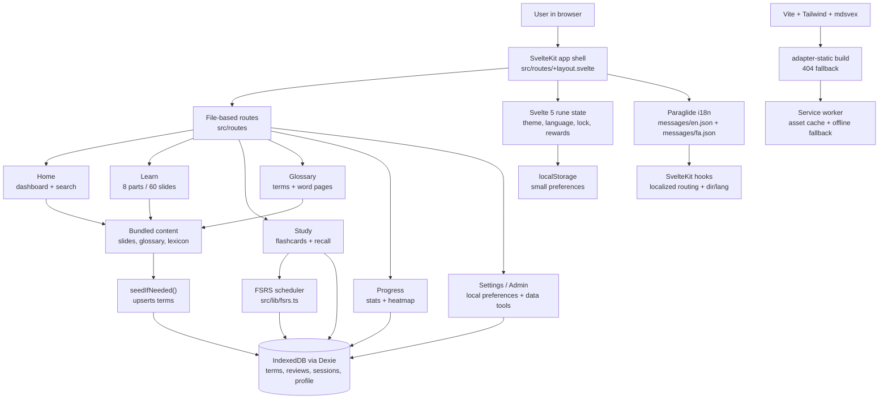

# accrev

accrev is a mobile-first SvelteKit study app for accounting review. It combines a bilingual English/Farsi glossary, a guided 60-slide learning deck, flashcard practice, FSRS spaced repetition, recall review, and local progress tracking.

The app is built as a mostly static SvelteKit site. Learning content ships with the bundle, while each user's study history stays in their browser through IndexedDB.

## What It Does

- Presents accounting concepts as an 8-part, 60-slide learning deck.
- Provides a bilingual glossary with term pages and slide cross-references.
- Runs flashcard sessions by CPA section, session size, and card direction.
- Schedules reviews with FSRS through `ts-fsrs`.
- Tracks streaks, XP, levels, mastered terms, lapsed terms, and recent sessions.
- Supports English and Farsi UI text through Paraglide/Inlang.
- Caches build assets and visited pages with a SvelteKit service worker.
- Includes a browser-only admin area for importing/exporting local study data.

## Architecture



## How The App Works

1. SvelteKit renders a static app shell from `src/routes/+layout.svelte`.
2. The root layout imports global CSS, initializes theme and language state, and gates the app behind the welcome screen until unlocked.
3. On the home and study pages, `seedIfNeeded()` loads bundled glossary terms into IndexedDB if the local seed version is stale.
4. Study sessions read terms from Dexie, grade answers, pass grades into `src/lib/fsrs.ts`, and persist updated review cards.
5. Progress pages query the same local database for streaks, XP, section mastery, lapsed terms, and recent sessions.
6. Learn and glossary pages use bundled content directly, with dynamic routes prerendered from their generated `entries()`.
7. Paraglide handles localized URLs, text direction, and generated message functions.
8. The service worker precaches build/static assets and falls back to cached pages when offline.

## Project Map

| Path                            | Purpose                                                                              |
| ------------------------------- | ------------------------------------------------------------------------------------ |
| `src/routes`                    | SvelteKit pages and route loaders.                                                   |
| `src/routes/+layout.svelte`     | Main mobile app shell, header, bottom nav, welcome gate, reward toast.               |
| `src/routes/+layout.ts`         | Enables prerendering for the static build.                                           |
| `src/routes/learn`              | Learning deck index, part pages, and individual slide pages.                         |
| `src/routes/study/+page.svelte` | Flashcard session flow, grading, XP, streak, and reward handling.                    |
| `src/routes/glossary`           | Searchable bilingual glossary.                                                       |
| `src/routes/word/[slug]`        | Individual term pages with related slides.                                           |
| `src/routes/progress`           | Streak, heatmap, mastery, and recent session views.                                  |
| `src/routes/admin`              | Client-only import/export and term management tools.                                 |
| `src/lib/db.ts`                 | Dexie schema and persistence helpers for terms, reviews, sessions, and profile.      |
| `src/lib/fsrs.ts`               | Adapter between local review records and `ts-fsrs`.                                  |
| `src/lib/seed.ts`               | Seeds bundled glossary data into IndexedDB.                                          |
| `src/lib/search.ts`             | Unified search across glossary terms, lexicon entries, and slides.                   |
| `src/lib/learn`                 | Generated slide data, slide navigation, search, and learn-specific components.       |
| `src/lib/state`                 | Svelte 5 rune-backed app state for language, theme, lock, rewards, and read state.   |
| `src/lib/data`                  | Curated glossary, research glossary, lexicon, and lookup helpers.                    |
| `messages`                      | Source translation files for Paraglide.                                              |
| `scripts`                       | Utilities for slide generation, lexicon extraction, and Open Graph image generation. |
| `static`                        | Manifest, robots file, icons, and social preview assets.                             |

## Getting Started

Install dependencies:

```sh
npm install
```

Start the dev server:

```sh
npm run dev
```

Open the app at the local URL printed by Vite, usually `http://localhost:5173`.

## Useful Commands

| Command                  | Description                            |
| ------------------------ | -------------------------------------- |
| `npm run dev`            | Start the Vite dev server.             |
| `npm run build`          | Build the static production app.       |
| `npm run preview`        | Preview the production build locally.  |
| `npm run check`          | Run SvelteKit sync and `svelte-check`. |
| `npm run lint`           | Run Prettier check and ESLint.         |
| `npm run format`         | Format the project with Prettier.      |
| `npm run setup:browsers` | Install Playwright Chromium.           |
| `npm run test:e2e`       | Run Playwright tests.                  |
| `npm run og:generate`    | Regenerate Open Graph image assets.    |

## Content And Data

The app has two kinds of data:

- Bundled content: slides, glossary entries, lexicon entries, messages, and static assets live in the repo and ship with the build.
- Local user data: review state, sessions, profile, XP, streaks, lapsed status, theme, language, and unlock state live in IndexedDB/localStorage in the user's browser.

There is no server database in the current architecture. Clearing site data resets the user's local progress.

## Internationalization

Paraglide/Inlang is configured in `project.inlang/settings.json` with English as the base locale and Farsi as the second locale. Source messages live in:

- `messages/en.json`
- `messages/fa.json`

Generated Paraglide files are written to `src/lib/paraglide` and are ignored by Git.

## Building And Deployment

The project uses `@sveltejs/adapter-static` with a `404.html` fallback. Most pages are prerendered, while `/admin` disables SSR and prerendering because it depends on browser-only APIs such as IndexedDB and file downloads.

For subpath deployments, set `BASE_PATH` before building:

```sh
BASE_PATH=/accrev npm run build
```

The service worker in `src/service-worker.ts` is bundled by SvelteKit and caches build assets, static files, and successful same-origin requests.

## Testing

Run static checks before shipping:

```sh
npm run check
npm run lint
```

Install Playwright's browser once, then run end-to-end tests:

```sh
npm run setup:browsers
npm run test:e2e
```
